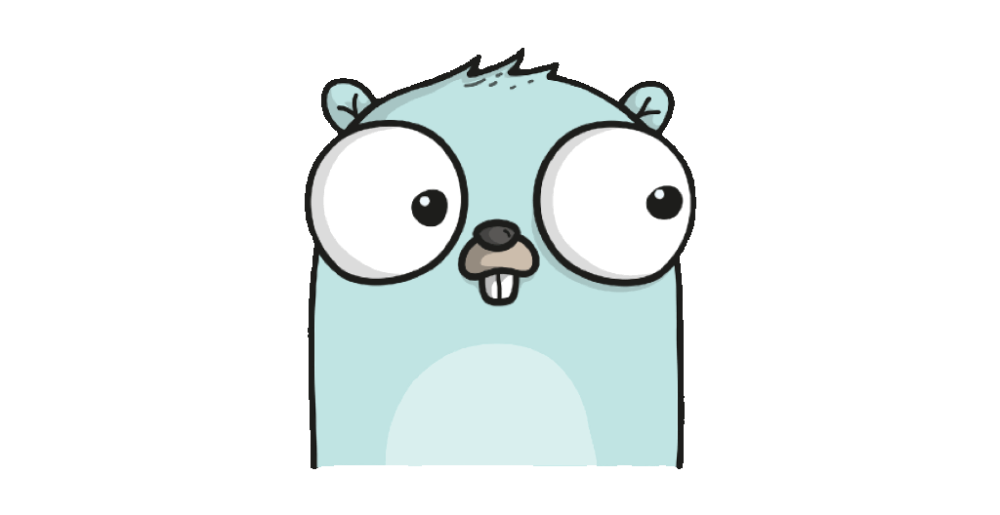

<h1 align="center">
    <br>Backend Template
</h1>

> Clean architecture based backend template in Go.

## Makefile

```shell
$ make

Usage: make [command]

Commands:
 rename-project name={name}    Rename project
 
 build-http                    Build http server

 migration-create name={name}  Create migration
 migration-up                  Up migrations
 migration-down                Down last migration

 docker-up                     Up docker services
 docker-down                   Down docker services

 fmt                           Format source code
 test                          Run unit tests

Requirements:
 docker-compose                Docker Compose CLI: https://docs.docker.com/compose/reference
 migrate                       Migration CLI tool: https://github.com/golang-migrate/migrate

```

## HTTP Server

```shell
$ ./bin/http-server --help

Usage: http-server

Flags:
  -h, --help               Show context-sensitive help.
      --env-path=STRING    Path to env config file
```

**Configuration** is based on the environment variables. See [.env.template](./config/env/.env.template).

```shell
# Expose env vars before and start server
$ ./bin/http-server

# Expose env vars from the file and start server
$ ./bin/http-server --env-path ./config/env/.env
```

## Request Collection
* [InsomniaV4](./assets/api-collection.insomnia-v4.json)

## License

This project is licensed under the [MIT License](https://github.com/pvarentsov/go-backend-template/blob/main/LICENSE).
